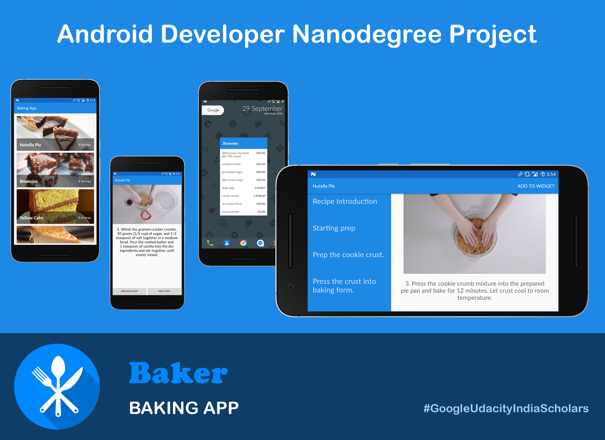

# Baking App
> Android app that will allow a user to select a recipe and see video-guided steps for how to complete it.

This will involve finding and handling error cases, adding accessibility features, allowing for localization, adding a widget, and adding a library.
This project was done as a part of Android Developer Nanodegree Program.

## Features

- Used MediaPlayer/Exoplayer to display videos.
- Handled error cases in Android.
- Added a widget to the app experience.
- Leveraged a third-party library in app.
- Used Fragments to create a responsive design that works on phones and tablets.

## Developed by

Pushpal Roy [Linkedin](https://www.linkedin.com/in/pushpalroy/)

## License

This project is licensed under the MIT License. See the [LICENSE.md](/LICENSE) file for details